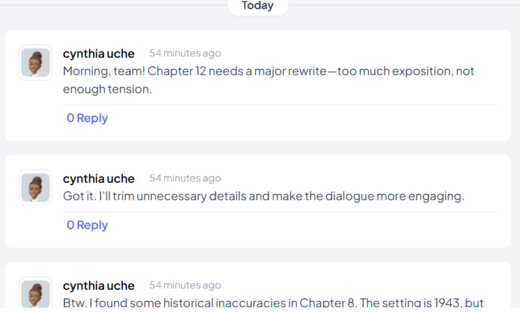
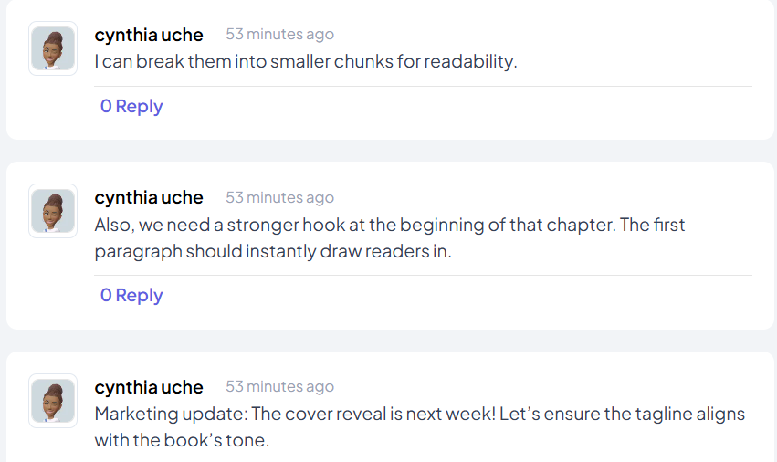
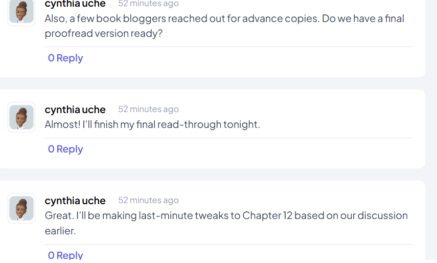
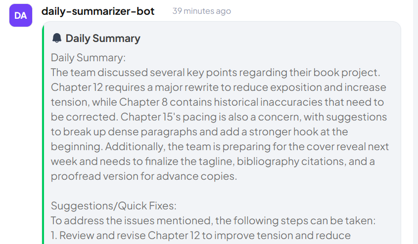

# Telex AI-Powered Daily Message Summarizer & Troubleshooting Assistant Integration

## Overview
This integration for Telex (`telex.im`) logs messages sent to a channel, summarizes them using AI, detects potential issues, and suggests troubleshooting steps. The summary and analysis are then sent back to the channel. The message log resets after each summary to ensure fresh processing.

## Features
- **Logs Messages**: Captures messages sent in a Telex channel.
- **AI-Powered Summarization**: Uses an AI agent to generate concise summaries.
- **Issue Detection**: Analyzes messages for problems and flags potential issues.
- **Automated Troubleshooting**: Suggests quick fixes for detected issues.
- **Scheduled Summaries**: Periodically sends summaries and resets logs after each execution.

## Project Structure
```
📂 telex-ai-integration
│── 📂 app                         # Main application package
│   │── 📂 routes                  # API routes
│   │   │── 📜 message_log.py      # Endpoint for logging messages
│   │   │── 📜 summary.py          # Endpoint for summarizing messages
│   │── 📂 services                # Core business logic
│   │   │── 📜 ai_service.py       # AI summarization and troubleshooting logic
│   │   │── 📜 message_store.py    # Message storage logic
│   │── 📜 models.py               # Pydantic models for request/response
│   │── 📜 config.py               # Configuration settings (env variables, API keys)
│   │── 📜 main.py                 # FastAPI backend entry point
│
│── 📂 static                      # Static assets (icons, images)
│   │── 📜 homework.png            # Bot icon
│   │── 📂 screenshots             # Screenshots of integration demo
│
│── 📜 requirements.txt            # Required dependencies
│── 📜 .env                        # API keys and environment variables
│── 📜 README.md                   # Project documentation
│── 📜 integration.json            # Telex integration configuration


## Setup & Installation
### Prerequisites
Ensure you have:
- Python 3.10+
- Pip & Virtual Environment
- An OpenAI/Groq API Key (or an alternative AI provider)

### Installation Steps
```bash
# Clone the repository
git clone https://github.com/telexorg/telex-ai-integration.git
cd telex-ai-integration

# Create a virtual environment
python -m venv venv
source venv/bin/activate  # On Windows use `venv\Scripts\activate`

# Install dependencies
pip install -r requirements.txt
```

### Environment Variables
Create a `.env` file in the project root and add:
```ini
OPENAI_API_KEY=your-api-key-here  # Or use Groq API Key
```

## Running the Integration
Start the FastAPI server:
```bash
uvicorn main:app --host 0.0.0.0 --port 8000 --reload
```
The server should now be running on `http://localhost:8000`.

## API Endpoints
### 1. Log Messages (`POST /message-log`)
Logs incoming messages.
#### Request:
```json
{
  "channel_id": "019525f6-8839-7db8-8dd3-d793448f9df2",
  "message": "Hello, I need help with my account!",
  "settings": [{"label": "interval", "type": "dropdown", "required": true, "default": "*/3 * * * *"}]
}
```
#### Response:
```json
{
  "event_name": "message_logged",
  "message": "Hello, I need help with my account!",
  "status": "success",
  "username": "daily-summarizer-bot"
}
```

### 2. Generate Summary (`POST /summary`)
Summarizes messages, detects issues, and suggests fixes.
#### Request:
```json
{
  "channel_id": "019525f6-8839-7db8-8dd3-d793448f9df2",
  "return_url": "https://telex.im/webhook"
}
```
#### Response:
```json
{
  "event_name": "Daily Summary",
  "message": "Summary of the day's messages...",
  "status": "success",
  "username": "daily-summarizer-bot"
}
```

## AI-Powered Message Processing
The integration utilizes an AI agent for:
- Summarization of logged messages.
- Issue detection using predefined keywords (e.g., "error", "broken").
- Automated troubleshooting suggestions.


## How It Works

### Step 1: A Team has discussion on the channel the entire day.
<div>
  
  
</div>

<div>
  
  
</div>


### Step 2: The integration summarizes the messages and offers suggestions/trouble-shooting steps.
<div>
  
  
</div>


## Deployment

### Deploying to Telex
1. Upload `integration.json` to a publicly accessible URL.
2. Install the integration in your Telex channel.
3. Configure it to trigger at desired intervals.

## Contribution Guidelines
- Follow GitHub best practices.
- Use meaningful commit messages (`feat: added AI summarization`).

## Future Improvements
- Multi-language support
- Advanced AI-based troubleshooting
- User feedback loop for better issue resolution

---
Developed as part of the Telex Integration Project 🚀

