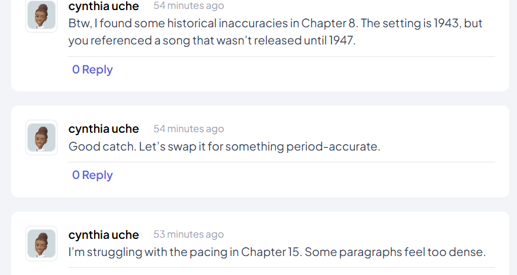
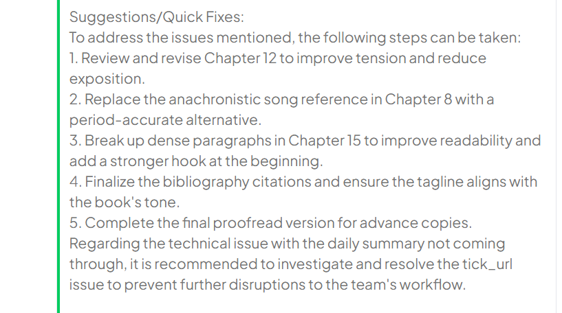

# Telex AI-Powered Daily Message Summarizer & Troubleshooting Assistant Integration

## Overview
This integration for Telex (`telex.im`) logs messages sent to a channel, summarizes them using AI, detects potential issues, and suggests troubleshooting steps. The summary and analysis are then sent back to the channel. The message log resets after each summary to ensure fresh processing.

## Features
- **Logs Messages**: Captures messages sent in a Telex channel.
- **AI-Powered Summarization**: Uses an AI agent to generate concise summaries.
- **Issue Detection**: Analyzes messages for problems and flags potential issues.
- **Automated Troubleshooting**: Suggests quick fixes for detected issues.
- **Scheduled Summaries**: Periodically sends summaries and resets logs after each execution.

## Project Structure
```
📂 telex-ai-integration
│── 📂 app                         # Main application package
│   │── 📂 routes                  # API routes
│   │   │── 📜 message_log.py      # Endpoint for logging messages
│   │   │── 📜 summary.py          # Endpoint for summarizing messages
│   │── 📂 services                # Core business logic
│   │   │── 📜 ai_service.py       # AI summarization and troubleshooting logic
│   │   │── 📜 message_store.py    # Message storage logic
│   │── 📜 models.py               # Pydantic models for request/response
│   │── 📜 config.py               # Configuration settings (env variables, API keys)
│   │── 📜 main.py                 # FastAPI backend entry point
│
│── 📂 static                      # Static assets (icons, images)
│   │── 📜 homework.png            # Bot icon
│   │── 📂 screenshots             # Screenshots of integration demo
│
│── 📜 requirements.txt            # Required dependencies
│── 📜 .env                        # API keys and environment variables
│── 📜 README.md                   # Project documentation
│── 📜 integration.json            # Telex integration configuration
```

## Setup & Installation
### Prerequisites
Ensure you have:
- Python 3.10+
- Pip & Virtual Environment
- An OpenAI/Groq API Key (or an alternative AI provider)

### Installation Steps
```bash
# Clone the repository
git clone https://github.com/telexorg/telex-ai-integration.git
cd telex-ai-integration

# Create a virtual environment
python -m venv venv
source venv/bin/activate  # On Windows use `venv\Scripts\activate`

# Install dependencies
pip install -r requirements.txt
```

### Environment Variables
Create a `.env` file in the project root and add:
```ini
OPENAI_API_KEY=your-api-key-here  # Or use Groq API Key
```

## Running the Integration
Start the FastAPI server:
```bash
uvicorn main:app --host 0.0.0.0 --port 8000 --reload
```
The server should now be running on `http://localhost:8000`.

## API Endpoints
### 1. Log Messages (`POST /message-log`)
Logs incoming messages.
#### Request:
```json
{
  "channel_id": "019525f6-8839-7db8-8dd3-d793448f9df2",
  "message": "Hello, I need help with my account!",
  "settings": [{"label": "interval", "type": "dropdown", "required": true, "default": "*/3 * * * *"}]
}
```
#### Response:
```json
{
  "event_name": "message_logged",
  "message": "Hello, I need help with my account!",
  "status": "success",
  "username": "daily-summarizer-bot"
}
```

### 2. Generate Summary (`POST /summary`)
Summarizes messages, detects issues, and suggests fixes.
#### Request:
```json
{
  "channel_id": "019525f6-8839-7db8-8dd3-d793448f9df2",
  "return_url": "https://telex.im/webhook"
}
```
#### Response:
```json
{
  "event_name": "Daily Summary",
  "message": "Summary of the day's messages...",
  "status": "success",
  "username": "daily-summarizer-bot"
}
```

## AI-Powered Message Processing
The integration utilizes an AI agent for:
- Summarization of logged messages.
- Issue detection using predefined keywords (e.g., "error", "broken").
- Automated troubleshooting suggestions.


## How It Works

### Step 1: A Team has discussion on the channel the entire day.
<div>
  
  
</div>

<div>
  
  
</div>


### Step 2: The integration summarizes the messages and offers suggestions/trouble-shooting steps.
<div>
  
  
</div>


## Deployment

### Deploying to Telex
1. Upload `integration.json` to a publicly accessible URL.
2. Install the integration in your Telex channel.
3. Configure it to trigger at desired intervals.


## Testing on the Telex Channel

### **1. Add the Integration**
Install the integration in your Telex channel.

### **2. Configure Scheduling**
Set up the summarization schedule, e.g.:
- Every 3 hours
- Once daily at 6 PM
- Every 5 minutes for rapid testing

### **3. Simulate a Day’s Conversation**
Use one of the sample test scenarios below or create a custom conversation of your own.

  #### **Test Scenario 1: Customer Support Team Handling User Complaints**

    Alice: Morning team! We've had multiple complaints about failed login attempts.
    Bob: Yeah, I checked—looks like some users are getting a "wrong password" error even after resetting.
    Charlie: Could be a caching issue. Have we tried clearing session tokens?
    Alice: Good point! I’ll ask DevOps to investigate session handling.
    Bob: Also, some users are reporting delayed email confirmations.
    Charlie: Sounds like a mail server delay. I’ll escalate it to IT.
    Alice: Great! Let’s document these issues for the team.


  #### **Test Scenario 2: Developer Team in a Fintech Company**

    Alice: Morning everyone! Did anyone else notice the API latency spike?
    Bob: Yeah, it started around midnight. Could be a database bottleneck.
    Charlie: Should we scale the read replicas?
    Alice: Might help. Also, some users are reporting transaction failures.
    Bob: I’ll check the logs and alert DevOps.
    Charlie: Let’s also update the status page.
    Alice: Agreed. Keeping users informed is key.


  #### **Test Scenario 3: Editorial Team Working on a Book**

    Sarah: Hey team, we need to finalize the chapter sequence today.
    Mark: Agreed! I think Chapter 5 should come before Chapter 3.
    Jane: That makes sense for narrative flow.
    David: We also need more historical references in Chapter 7.
    Sarah: I’ll compile a list of potential sources.
    Mark: Let’s review everything by 3 PM.

### **4. Wait for the Bot to Generate a Summary**
The AI will process messages and send a summary with troubleshooting suggestions based on the interval you set.

## Contribution Guidelines
- Follow GitHub best practices.
- Use meaningful commit messages (`feat: added AI summarization`).

## Future Improvements
- Multi-language support
- Advanced AI-based troubleshooting
- User feedback loop for better issue resolution

---
Developed as part of the Telex Integration Project 🚀

